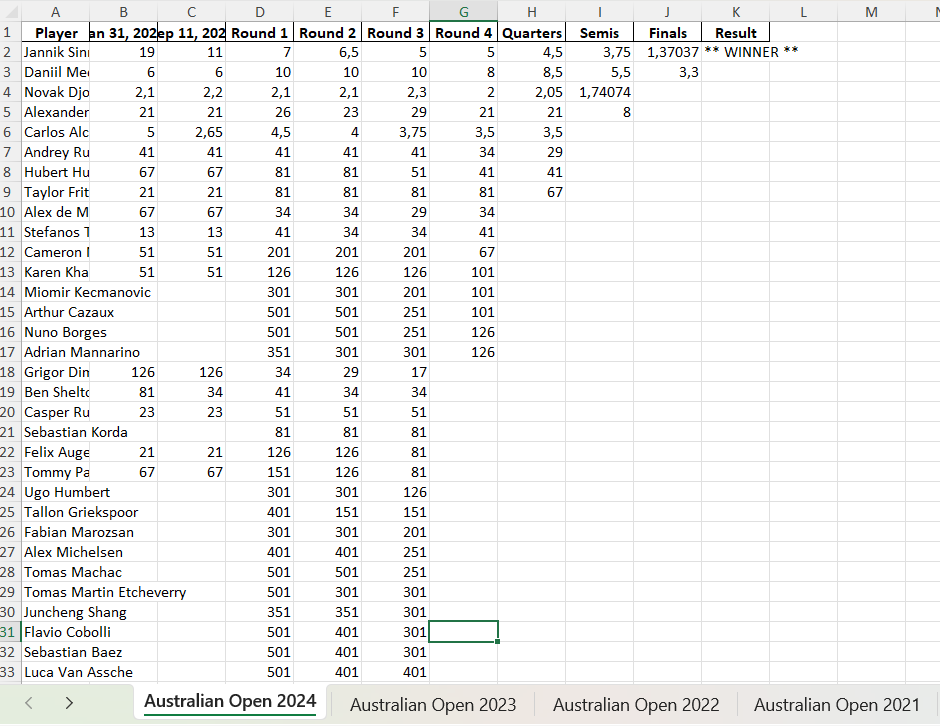
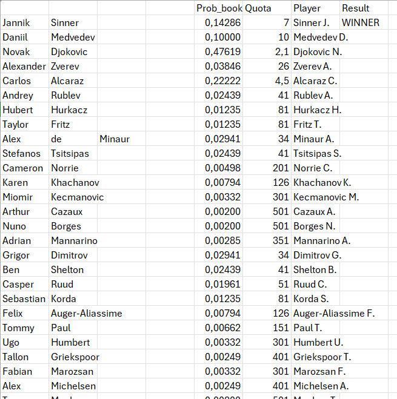
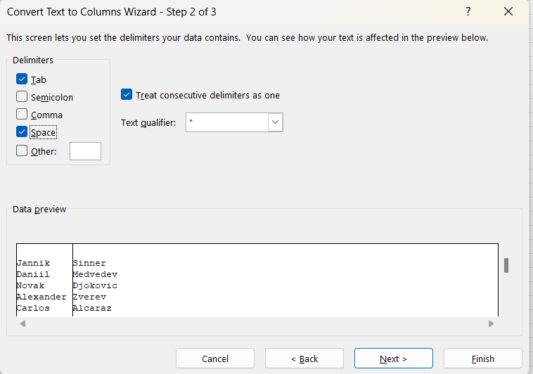

# Grand Slam Odds Scraping and Processing

This repository contains two Python scripts for scraping and processing ante-post odds for the 23 Grand Slam tournaments.

## Scripts Overview

1. **scraping.py**: Scrapes ante-post odds from [sportsoddshistory.com](https://www.sportsoddshistory.com) and saves the data into `output.xlsx`.
2. **modify.py**: Cleans `output.xlsx` by removing missing values, converting American odds to decimal odds, and outputs a cleaned file called `output2.xlsx`.

## Output Structure

The final `output2.xlsx` will contain different sheets for each scraped tournament. 


### Further Data Transformation

To evaluate a betting strategy using simulation results from the EloMC R package (available [here](link)), additional transformations are required.

#### Final Structure Requirements

The final results should look like this: 


### Steps to Achieve the Final Structure

1. **Data Preparation**:
   - Open `output2.xlsx`.
   - Select the first column.
   - Go to **Data > Text to Columns**.
   - Click **Next** and check the box for **Space**, then complete the process.

   

2. **Create Player Column**:
   - Use the formula in the Player column:
     ```excel
     =(IF(D2<>"";D2;IF(C2<>"";C2;IF(B2<>"";B2;"")))) &" " & LEFT(A2;1) &"."
     ```

3. **Results Column**:
   - Type "WINNER" in the first row of the Results column for each sheet.

After completing these steps, your `output2.xlsx` can be used with the `Extract_book` function of the EloMC package.

### Pre-Cleaned Data

For convenience, the file `Database Tennis.xlsx` contains the odds data already cleaned and ready for use.

